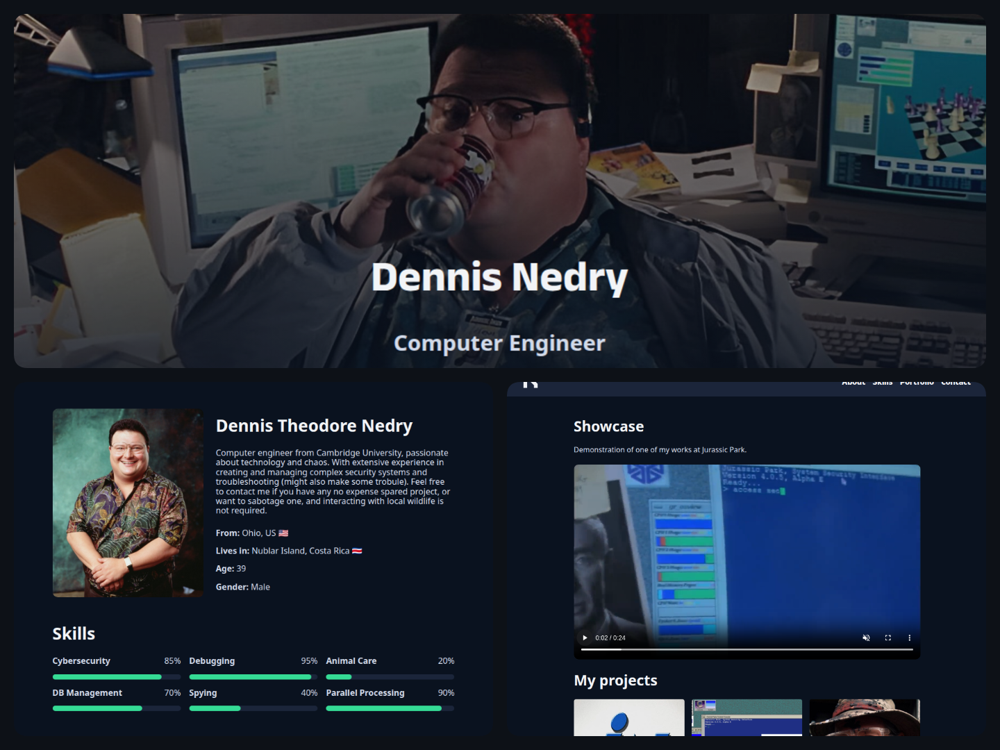

# Porfolio Web - Dennis Nedry

Este es un proyecto de práctica para KeepCoding que utiliza **HTML5** y **CSS3**. En este portfolio se presentan los conceptos aprendidos durante el el módulo de Fundamentos Web HTML CSS.

## 📌 Tabla de contenidos
- [Descripción](#descripción)
- [Instalación](#instalación)
- [Uso](#uso)
- [Tecnologías y Prácticas Utilizadas](#tecnologías-utilizadas)
- [Capturas](#capturas)
- [Autor](#autor)

## ✏️ Descripción

Este proyecto es un portfolio web sobre Dennis Nedry, personaje de ficción de *Jurassic Park*, que muestra ejemplos del trabajo realizado únicamente con HTML y CSS.

## Instalación

Puedes visualizar la página en este [enlace](https://miguelferlez.github.io/keepcoding-practica-html-css/).

Para ver el proyecto en tu máquina local, sigue estos pasos:

1. Clona este repositorio:

    ```bash
    git clone https://github.com/miguelferlez/keepcoding-practica-html-css.git
    ```
2. Navega al directorio del proyecto:

    ```bash
    cd keepcoding-practica-html-css
    ```
3. Abre el archivo `index.html` en tu navegador.

## 👋 Uso

Abre el archivo `index.html` en tu navegador para ver los distintos apartados del portfolio.

⚠️ **¡Atención! Rellenar y guardar el formulario conduce a un error 405**, no está diseñado para enviar los datos a un servidor real.

## 🛠️ Tecnologías y Prácticas Utilizadas

- HTML
    - ✅ Etiquetas semánticas
    - ✅ Propiedades ARIA y accesibilidad
    - ✅ Formularios y validación de datos
    - ✅ Grid Display
    - ✅ Responsive Images
- CSS
    - ✅ Fuentes personalizadas
    - ✅ Mobile First
    - ✅ Responsive Design y Media Queries
    - ✅ Animaciones con Keyframes y Transitions

## 📷 Capturas

</img>

## 🧑‍💻 Autor

Miguel Fernández @miguelferlez
